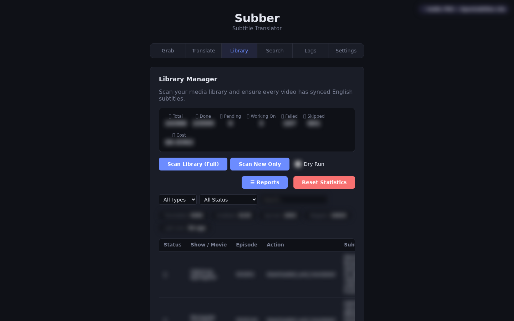
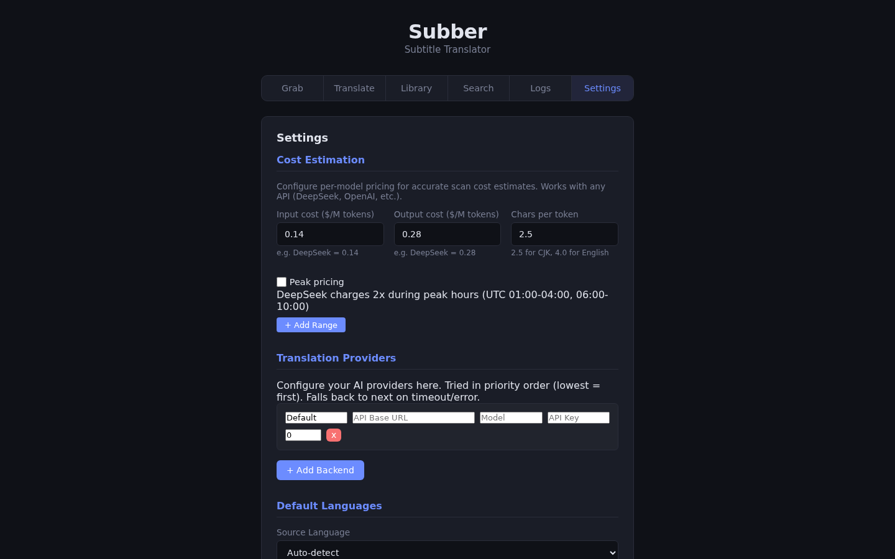
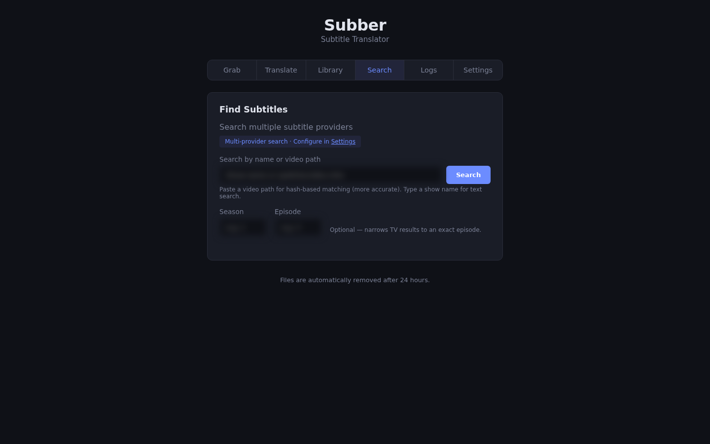
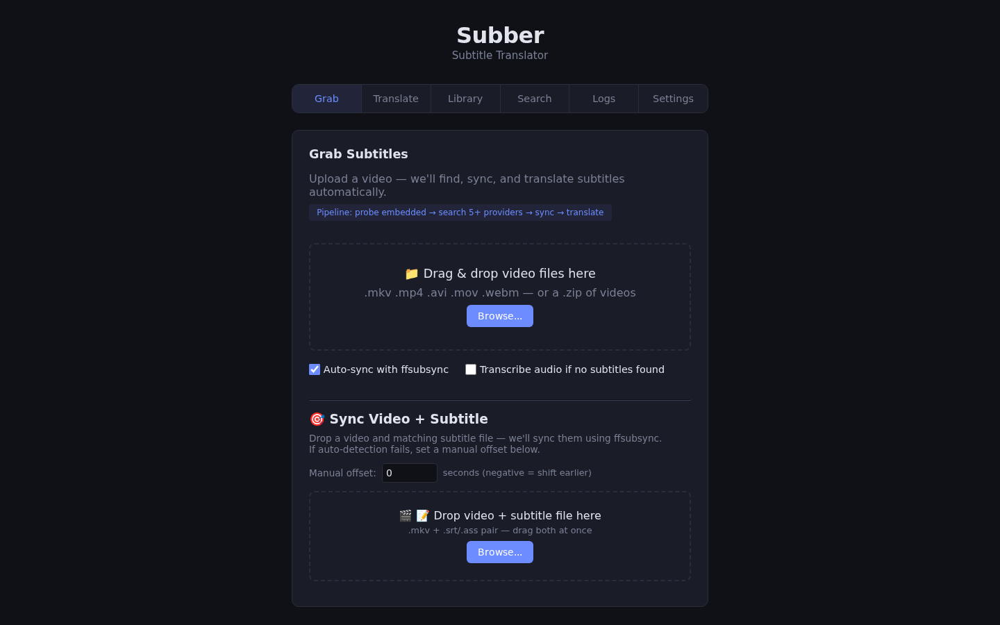

# Subber

**Subtitle grabber, sync, and translator — Docker + Web UI.**

Upload a video, Subber finds subtitles across 5 providers, syncs them with ffsubsync, and translates non-English subs using **OpenRouter Llama 3.1 8B** (recommended — fast, cheap, accurate) with DeepSeek or Ollama as fallbacks. If no subtitle exists at all, it can transcribe the audio track itself via a self-hosted Whisper server. Or scan your entire media library and Subber handles everything automatically.

## 📸 Screenshots

| Library | Settings |
|---|---|
|  |  |
| **Search** | **Grab** |
|  |  |

## ⚙️ How It Works

A library scan follows a deterministic pipeline designed to be **safe to run repeatedly** on a live media collection:

1. **Mounts SMB/CIFS shares** — auto-mounts configured shares at scan start (30s timeout, dead mounts abort cleanly instead of failing every file)
2. **Walks the filesystem** — discovers new, changed, and unprocessed files; skips anything already marked `done` in the DB
3. **Checks for existing subtitles** — if a non-empty `.en.srt`/`.en.ass` already sits next to the video, it's skipped immediately (no re-download, no re-sync)
4. **Extracts embedded subtitles** — ffmpeg pulls subtitle tracks from video files (configurable timeout, partial output cleaned on failure)
5. **Searches external providers** — SubDL → Gestdown → Podnapisi, with OpenSubtitles as a rate-limited fallback; episode-matching guard prevents wrong-episode downloads; zip/gzip packs are unpacked and matched
6. **Transcribes via ASR (fallback)** — if nothing is found anywhere and ASR is enabled, Subber transcribes the audio track itself via a self-hosted Whisper server
7. **Syncs with ffsubsync** — audio-alignment with drift threshold; skips re-sync if drift is below threshold
8. **Translates if needed** — language is detected from the subtitle's actual text (not its filename); non-English subs go through the LLM backend chain (OpenRouter → DeepSeek → Ollama) with automatic fallback, and foreign fansubs are first stripped of sign/song/karaoke lines so only dialogue is translated
9. **Marks complete** — writes result to SQLite; scan progress, costs, and timing are all persisted

**Crash recovery:** if the container dies mid-scan, Resume picks up exactly where it left off — done files are skipped, in-progress files are re-processed. An automatic DB backup runs before every scan (newest 5 kept, oldest cycled out).

## 🚀 Quick Start (Docker)

### 1. Clone and configure

```bash
git clone https://github.com/completeBeta/Subber.git
cd Subber

# Copy the example files to create your own config
cp config.example.yaml config/config.yaml
cp docker-compose.example.yml docker-compose.yml
```

### 2. Edit your config

**`config/config.yaml`** — add your API keys (all optional, but recommended):
- `translation.backends[0].api_key` — OpenRouter API key (for translation, recommend Llama 3.1 8B ~$1 to translate hundreds of episodes)
- `translation.backends[1+]` — DeepSeek, Ollama, or any OpenAI-compatible fallback
- `providers.subdl.api_key` — free from [subdl.com](https://subdl.com)
- `providers.opensubtitles` — see [OpenSubtitles Setup](#-opensubtitles-setup) below

**`docker-compose.yml`** — uncomment and set your media paths:
```yaml
volumes:
  # Uncomment and set your media paths:
  - /path/to/your/media:/mnt/library:rw
```

### 3. Start

```bash
docker compose up -d --build
# Open http://localhost:8676  (or your SUBBER_PORT if you changed it)
```

> **All config can also be set via the Web UI** at `/settings` after first start. The config files just save you from re-entering keys on every rebuild.

> **Minimal setup:** If you don't need translation or provider subtitles, just run step 3. Embedded subtitle extraction works with zero config.

## 🔄 Updating

When a new version is released, update in place:

```bash
cd Subber
git pull
docker compose up -d --build
```

**Your personal files are never overwritten.** The files you interact with are gitignored, so `git pull` leaves them untouched:

| File | You edit it? | Updated by `git pull`? |
|---|---|---|
| `docker-compose.yml` | ✅ yes (media mounts, port) | ❌ no — your copy |
| `config/config.yaml` | ✅ yes (API keys, providers, mounts) | ❌ no — your copy |
| `docker-compose.example.yml` | ❌ no (template) | ✅ yes — may change |
| `config.example.yaml` | ❌ no (template) | ✅ yes — may change |

**When do you need to read this README?** Only in two situations:

1. **First install** — the Quick Start above.
2. **When a release changes the example config** — if an update adds or renames a config option, the release notes / `git pull` output will tell you. In that case, diff your `config/config.yaml` against `config.example.yaml` (or re-check the relevant README section) to see if you want the new defaults. Everything else (providers, subtitles, sync) updates automatically with no action on your part.

If `git pull` ever reports a conflict, your local edits are the cause — recover with `git stash && git pull && docker compose up -d --build` (this is rare, since the files you edit are ignored).

## 🧪 Testing on a second instance

To run an isolated copy alongside your live instance (separate port, separate config/data/uploads) — useful for trying changes before your users hit them:

```bash
cp docker-compose.test.yml docker-compose.test.local.yml   # optional: tweak port
docker compose -f docker-compose.test.yml up -d --build
# Open http://localhost:8677  (starts with unconfigured settings)
```

It uses port `8677` and its own `config-test/`, `data-test/`, `uploads-test/` directories, so it won't touch your live instance.

## 📑 Tabs

### 🎬 Grab
Upload one or more video files (or a `.zip` of videos) and Subber runs the full pipeline on each: probe for embedded subtitles → search external providers → download the best match → sync with ffsubsync → translate if needed.

**Controls:**
- **Browse / drag-and-drop** — add video files or a zip batch
- **Auto-sync with ffsubsync** checkbox — toggle audio alignment on/off
- **Start Processing** — begin the pipeline on the selected files
- **Clear** — remove the selected files before processing
- **Pipeline log** (expandable) — live per-file progress
- **+ Add Another** — reset the form to process more files
- **Clear History** — wipe the on-page results list

**🎯 Sync Video + Subtitle** (below the main grab zone) — drop a video + subtitle pair and ffsubsync aligns them. If auto-detection fails, enter a **manual offset** (seconds, negative = shift earlier).

### 📚 Library
Scan your media library. Subber walks your configured directories, classifies files as TV/movie, identifies shows, detects which files already have subtitles, and processes the rest — extracting embedded subs, searching providers, syncing, and translating automatically.

**Controls:**
- **Scan Library (Full)** — re-check every file (already-done files are skipped)
- **Scan New Only** — process only new/changed files
- **Pause / Resume / Cancel Scan** — appear while a scan is running
- **☰ Reports** — generate, view, save, and download Markdown reports
- **Reset Statistics** — clear the scan counters
- **Status pills** (Total / Done / Pending / Failed / Skipped) — click any pill to filter the list
- **Retry** (per file) — re-process a single failed file
- **🔄 Retry All** — banner when viewing failed files; re-queues all of them
- **Pagination** (First / Prev / Next / Last) — page through large libraries

### 🌍 Translate
Upload `.srt`, `.ass`, `.vtt`, or `.zip` subtitle files and translate them between languages using your configured LLM backends.

**Controls:**
- **From / To** dropdowns — source and target language
- **Translate** — start the translation
- **Cancel** — stop an in-progress job
- **Download Translated File** — save the result
- **Recent Translations** — history of past jobs with progress; **Clear History** wipes it

### 🔍 Search
Search all enabled providers by show name or video path, and download a specific subtitle from the results.

**Controls:**
- **Search box** — type a show name (text search) or paste a video path (hash-based matching, more accurate)
- **Search** — run the query across providers
- **Download** (per result) — fetch that subtitle file

### 📋 Logs
Real-time log viewer with filtering and export.

**Controls:**
- **Search / Level / Lines** — filter by text, log level, and line count
- **Auto-refresh** checkbox — poll for new lines every 5 seconds
- **🔄 Refresh / Clear** — reload the log or reset filters
- **⬇ Download Log** — download the current log file
- **⬇ Export Full History** — all rotated daily files + current log in one file
- **🩺 Diagnostics** — download a redacted system/config/error bundle (safe to share in bug reports)
- **📊 API Calls Today** — live per-provider search/download counts

### ⚙️ Settings
Full configuration UI. **Save Settings** persists everything (with validation that blocks saving a broken config).

- **Cost Estimation** — per-token pricing with peak-hour multipliers (**+ Add Range**)
- **Translation Providers** — add/remove LLM backends with priority ordering (**+ Add Backend**)
- **Default Languages** — preferred subtitle language order and acceptable track types
- **Subtitle Sync** — sync engine and drift threshold
- **Subtitle Providers** — enable/disable providers and enter credentials (SubDL key, OpenSubtitles, Gestdown)
- **Library Settings** — scan paths, concurrency, auto-scan interval, the **Transcribe audio when no subtitle found** fallback toggle, and **Ad / Credit Removal** mode
- **🎙️ Audio Transcription (ASR)** — self-hosted Whisper server URL, model, language, and mode
- **📺 Show Identification** — TMDB API key (AniList needs no key)
- **Library Mounts (SMB/CIFS)** — add mounts (**+ Add Mount**), **Test** a share, **Remove** it
- **💾 Database Backups** — **Backup Now**, **Refresh** the list, **Restore**, or delete a backup
- **⚠ Caution Zone** — upload size and minimum-free-disk limits
- **🔒 Security** — optional API key to protect write operations
- **⚙️ Advanced** (collapsed) — watchdog timeout, translation tuning (temperature, chunk size, retries), scan tuning (drift threshold, concurrency, interval), and show-identification preferences

## 🌍 Subtitle Providers

Providers are searched in priority order. **OpenSubtitles is a fallback** — only searched if primary providers (SubDL, Gestdown, Podnapisi) return nothing. This saves your daily quota for when nothing else works.

| Provider | Type | Auth | Daily Limits | Fallback? |
|---|---|---|---|---|
| 🎬 **Embedded** | ffmpeg extraction | None | Unlimited | No |
| 🔑 **SubDL** | REST API | API key | Free: 2,000 requests + 50 downloads · PRO: 30,000 requests + 2,000 downloads | No |
| 📺 **Gestdown** | REST API (Addic7ed proxy) | None | Fair use (no published limit) | No |
| 🌍 **Podnapisi** | Web scraping | None | Fair use (no published limit) | No |
| 🌐 **OpenSubtitles** | REST API | .org user/pass or .com API key | .org VIP: 1,000 downloads · .com API: 5 (free) → 100,000 (Pro) downloads | **Yes** |

### 🔑 OpenSubtitles Setup

OpenSubtitles offers two ways to authenticate — choose **one or the other**. Each has its own API key, so switching modes never erases the other's credentials:

#### opensubtitles.org VIP (1,000 downloads/day)
If you have a VIP subscription at [opensubtitles.org](https://www.opensubtitles.org):
1. Create a **free API consumer key** at [opensubtitles.com/consumers](https://www.opensubtitles.com/en/consumers) (takes 10 seconds)
2. In Subber Settings → OpenSubtitles, set Mode to **VIP — .org auth (1,000/day)**:
   - **VIP API Key** — paste your consumer key in the dedicated VIP key field
   - **Username** — your opensubtitles.org username
   - **Password** — your opensubtitles.org password
3. The VIP key is **separate from** the `.com` API key — switching modes never blanks the other.

> **Why the API key?** The `.org` and `.com` share the same REST API. The consumer key authorizes API access; your username+password authenticates your VIP account.

#### opensubtitles.com API Consumer (package-based limits)
If you purchased an API package at [opensubtitles.com](https://www.opensubtitles.com):
1. Get your API key from [opensubtitles.com/consumers](https://www.opensubtitles.com/en/consumers)
2. In Subber Settings → OpenSubtitles → `.com API Consumer Key` section, paste your key
3. Select the plan your key is subscribed to:

| Plan | Downloads/24h |
|---|---|
| Free | 5 (anonymous-download default) |
| Developer | 100 (the "Under dev" consumer-key flag) |
| Light ($20/mo) | 2,000 |
| Startup ($50/mo) | 5,000 |
| Basic ($100/mo) | 15,000 |
| Premium ($200/mo) | 50,000 |
| Pro ($400/mo) | 100,000 |
| Enterprise | custom |

> **Free vs Developer** are consumer-key flags, not paid plans: "Allow anonymous downloads" caps a key at 5/day, and the "Under dev" flag raises it to 100/day without authentication. Light and above are paid API subscriptions — ad-free, and only **downloads** are limited (search and other endpoints are unlimited, subject to a per-IP request rate of 5 req/s free → 50 req/s Basic and up). Yearly billing gives a 20% discount.

## 🎙️ Audio Transcription (ASR / Whisper)

When a video has **no embedded subtitle and no provider match**, Subber can generate subtitles itself by transcribing the audio track with a self-hosted [Whisper](https://github.com/openai/whisper) server. This is opt-in and **off by default**.

### How it works

1. **Extract** — ffmpeg pulls the audio track into a mono 16 kHz WAV (Whisper's preferred input).
2. **Transcribe** — the audio is sent to your server's OpenAI-compatible `/v1/audio/transcriptions` endpoint (`response_format=verbose_json`).
3. **Write** — Whisper's timestamped segments become an `.srt`.
4. **Translate** — if the detected language isn't English, the transcript is auto-translated through your LLM backend chain (the same path as a downloaded subtitle).

### Running a Whisper server

Subber talks to any OpenAI-compatible Whisper server, e.g. [faster-whisper-server](https://github.com/fedirz/faster-whisper-server) or an equivalent. Run it somewhere on your network and point Subber at its URL.

- **GPU strongly recommended** — CPU transcription is far slower than realtime.
- **Model** — `large-v3-turbo` is the recommended sweet spot: on a modest GPU it transcribes at roughly **12× realtime** (a 20-minute episode in ~1¾ minutes). Larger models like `large-v3` can run out of VRAM on 8 GB cards.
- Any faster-whisper size alias (`tiny` → `large-v3`) or a HuggingFace repo id works.

### Configure it in Subber

**Settings → 🎙️ Audio Transcription (ASR):**

- **Transcription mode** — `Auto` (enables the Grab-tab transcribe checkbox) or `Off`.
- **Whisper model** — `large-v3-turbo` (recommended).
- **Language** — `auto` to auto-detect, or a Whisper code (`ja`, `ko`, `en`, …) to force one.
- **Whisper server URL** — e.g. `http://your-server:9000`.
- **Whisper server API key** — only if your server requires a Bearer token.

Then turn on the fallback where you want it:

- **Grab tab** — tick **"Transcribe audio if no subtitles found"** on an upload.
- **Library scans** — enable **Library Settings → "Transcribe audio when no subtitle found"**.

Or set it directly in `config/config.yaml`:

```yaml
asr:
  mode: auto                    # off | auto
  model: large-v3-turbo
  language: auto                # auto | a whisper code (ja, ko, en, ...)
  timeout: 600                  # per-request seconds for the transcription call
  max_audio_seconds: 3600       # hard cap — abort if the audio is longer than this
  backends:                     # ordered failover
    - name: Whisper (local)
      url: http://your-server:9000
      api_key: ""               # only if your server requires one
      model: large-v3-turbo     # optional per-backend override

library:
  asr_fallback: true            # transcribe when a scan finds no subtitle
```

Multiple `asr.backends` are tried in order (failover) until one returns HTTP 200.

## 🤖 LLM Backends

Subber uses a multi-backend translator with automatic fallback. **Recommended setup:**

```yaml
backends:
  - name: OpenRouter Llama 3.1 8B
    api_base: https://openrouter.ai/api/v1
    model: meta-llama/llama-3.1-8b-instruct
  - name: DeepSeek V4 Flash (fallback)
    api_base: https://api.deepseek.com/v1
    model: deepseek-v4-flash
  - name: Ollama (local)
    api_base: http://localhost:11434/v1
    model: llama3.2:3b
```

OpenRouter Llama 3.1 8B costs ~$1 to translate **hundreds** of episodes — far cheaper than DeepSeek and better at subtitle-format adherence. Works with any OpenAI-compatible API — cloud or local.

## 📺 Show Identification

Subber resolves messy filenames into canonical metadata:

| File | → | Identified As |
|---|---|---|
| `Busamen Gachi Fighter 01.mkv` | → | **Uglymug, Epicfighter** (AniList #184575) |
| `7th.Time.Loop.S01E01.mkv` | → | **7th Time Loop: The Villainess Enjoys...** (AniList #168374) |

- **AniList** (free, no key) — covers anime
- **TMDB** (optional free API key) — covers movies/TV
- **Rate-limited**: 1 req/670ms (safe under 90/min limit)
- **Cached**: second query is instant
- **Batch deduplication**: 1000 files across 4 shows = 4 API calls

## 🔒 Security

An optional **API key** protects write operations (scan, translate, grab, settings changes). Disabled by default — set it in Settings → Security if you expose Subber beyond your LAN.

```
# Without API key (default): everything works
curl -X POST http://localhost:8676/api/library/scan ...

# With API key set: all writes require the header
curl -X POST http://localhost:8676/api/library/scan \
  -H "X-API-Key: your-key-here" ...
```

GET endpoints (read-only) are always open. Write endpoints (scan, translate, grab, settings changes) require the `X-API-Key` header **only when a key is configured**. When no key is set, writes are open — so you can always set your first key via the Settings UI.

For SSL, use Cloudflare Tunnel or a reverse proxy (nginx/Caddy). Subber itself runs plain HTTP on port 8676 (change it via the `SUBBER_PORT` env var in `docker-compose.yml`).

## 🔧 Architecture

```
Video file → ffprobe (subtitle tracks)
           → identify.py (AniList/TMDB → canonical titles)
           → ProviderRegistry.search_all() (primary providers first, fallback last)
           → Download best match
           → ffsubsync (audio alignment)
           → OpenRouter/DeepSeek/Ollama (translation if needed)
           → Save to library / return to user
           → Cost estimator: per-token input+output pricing
           → Cancel scan: DELETE /api/library/scan/{id}
           → Incremental progress: per-file scan counter updates
```

### File Structure

```
src/subber/
├── web.py              # FastAPI app, all routes + auth
├── config.py           # YAML config with deep merge
├── identify.py         # AniList + TMDB show identification
├── translator.py       # Multi-backend LLM translator
├── transcriber.py      # ASR: audio → subtitle via Whisper server
├── parser.py           # Subtitle parsing + content-first language detection
├── syncer.py           # ffsubsync wrapper (0.5.0 compat)
├── ad_removal.py       # Strip ad/credit lines from downloaded subs
├── downloader.py       # Subtitle download handling
├── safewrite.py        # Safe subtitle file writes
├── logsanitize.py      # Secret redaction for logs/diagnostics
├── rate_limit.py       # Provider rate limiting
├── types.py            # Shared data types
├── cli.py              # CLI entrypoint
├── providers/          # Subtitle provider implementations
│   ├── subdl.py        # SubDL REST API
│   ├── gestdown.py     # Gestdown REST API (Addic7ed proxy)
│   ├── podnapisi.py    # Podnapisi scraper
│   ├── opensubtitles.py # OpenSubtitles REST API (rate-limited)
│   ├── embedded.py     # ffmpeg subtitle extraction
│   ├── registry.py     # Parallel provider search (primary-first, fallback-last)
│   ├── provider_stats.py # API call tracking per provider
│   └── base.py         # Abstract provider + capabilities
├── library_db.py       # SQLite schema + CRUD + report generation
├── library_scanner.py  # Filesystem walker + classifier
└── library_pipeline.py # Orchestrator (detect → extract → translate → sync)

templates/
├── grab.html           # Grab tab
├── index.html          # Translate tab
├── library.html        # Library tab (+ reports panel)
├── logs.html           # Log viewer (+ API stats)
├── settings.html       # Settings tab (+ security)
├── search.html         # Search tab
├── sync.html           # Sync video + subtitle
└── base.html           # Shared layout + nav

static/
├── style.css           # Global styles
├── library.css         # Library-specific styles
└── app.js              # Translate tab JS
```

## 🐳 Docker

```bash
docker compose up -d --build
```

- Runs on port `8676` by default (set `SUBBER_PORT` in `docker-compose.yml` to change it)
- Volume mounts: `./uploads`, `./config`, `./data` (SQLite + logs + reports + stats)
- Library mount: `/mnt/test_library` → your media directory
- Host networking mode (required for provider API access)
- Auto-cleanup: temporary files removed after 24 hours
- Logs: daily rotation with 45-day retention at `/app/data/subber.log`
- Full-history log export + redacted diagnostics bundle via Logs tab
- Provider stats: daily API call counts at `/app/data/provider_stats.json`
- Reports: Markdown reports at `/app/data/reports/`

## 📦 Installation (without Docker)

```bash
pip install git+https://github.com/completeBeta/Subber.git

# Or for local development:
git clone https://github.com/completeBeta/Subber.git
cd Subber
pip install -e ".[dev]"
```

## 📋 Requirements

- **Docker** with Docker Compose
- **SMB/CIFS mounts** (optional): container needs `cap_add: [SYS_ADMIN, DAC_READ_SEARCH]` in `docker-compose.yml`
- **cifs-utils**: installed automatically in the Docker image (for SMB mount support)
- **Translation**: OpenRouter API key (recommended — Llama 3.1 8B), or DeepSeek/Ollama for local/alternative
- **Subtitles**: free API keys from SubDL and OpenSubtitles (optional but recommended)

## 🔑 Configuration

All configurable via the Web UI at `/settings`. Config file at `config/config.yaml` (Docker) or `~/.config/subber/config.yaml` (standalone).

Key sections: `translation.backends`, `providers`, `library`, `sync`, `cost`, `limits`, `ui` (API key).

## 🚧 WIP

- **Per-category library scans** — scan only Movies or only TV shows instead of the whole library at once.

## 💡 Feature Requests

- **Full mobile responsiveness** — make the whole UI (nav, tables, forms, banners) usable on phone-sized screens.

## 🐛 Reporting Issues

Found a bug or something behaving oddly? Report it on [GitHub Issues](https://github.com/completeBeta/Subber/issues/new/choose) — that's the one place all reports go, so nothing gets lost.

Include these six things to make it quick to diagnose:

1. **The Diagnostics bundle** — Logs tab → 🩺 Diagnostics → download. It packs your (redacted) logs, config shape, system info, scan state, and restart history into one file. This is the single most useful thing you can attach.
2. **What you did** — which tab, what file, what you clicked.
3. **What you expected vs. what actually happened.**
4. **The exact error message** — paste the text, or attach a screenshot (blur anything private first).
5. **Your version** — shown in the footer of every page (e.g. `v0.7.0`).
6. **When it started** — right after an update, or has it always done this?

> ⚠️ **Privacy:** the Diagnostics bundle is redacted (API keys, passwords, and IPs are masked), so it's safe to attach publicly. The raw logs under **Logs → Export Full History** are *not* redacted — don't post those publicly.

## 📜 License

MIT — see [LICENSE](LICENSE).
